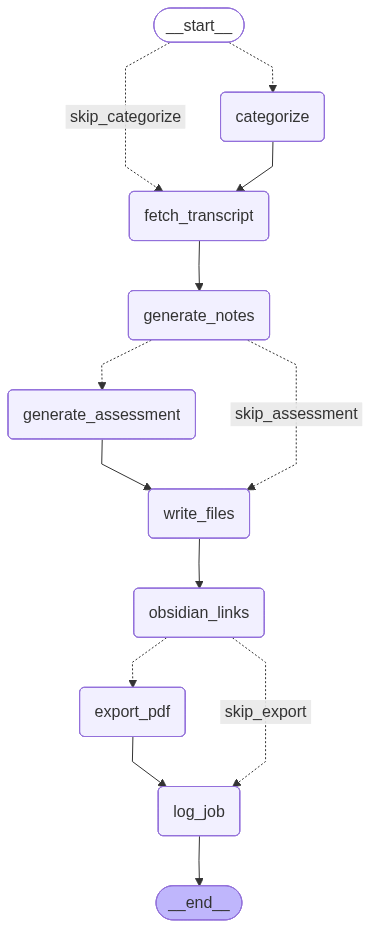

# YouTube Study Buddy

Learning from educational YouTube videos and want to maximize retention? **YT Study Buddy** transforms passive video watching into active learning by generating structured study notes with intelligent cross-referencing and targeted assessment questions. The system builds your personal knowledge graph over time, connecting concepts across videos, while quiz-style assessments test understanding beyond surface-level recall—turning scattered video content into an interconnected learning system that actually improves retention.

## 🧠 The Science: Active Learning vs Passive Watching

**Traditional passive note-taking** often leads to the "illusion of competence" – where learners feel they understand content simply because they've transcribed it. YT Study Buddy implements research-backed learning principles:

- **Dual Coding Theory** – Combines text with visual spatial organization for stronger memory formation
- **Generation Effect** – Assessment questions force active answer generation, improving retention
- **Desirable Difficulties** – "One-up" challenges introduce productive struggle beyond the presented material
- **Elaborative Interrogation** – Gap analysis questions reveal what your brain filtered out
- **Spaced Retrieval Practice** – Separation of note generation from video watching enables spaced review

**Result:** Instead of passive consumption, you get an active learning system with notes AND assessment questions that test understanding beyond surface-level recall.

## Features

### Core Capabilities
- 🤖 **AI-Powered Notes** - Claude Sonnet 4.5 generates comprehensive study materials
- 📝 **Learning Assessments** - Automatic quiz generation with gap analysis
- 🏷️ **Auto-Categorization** - ML-based subject detection
- 📊 **Knowledge Graph** - Cross-reference related concepts
- 📄 **PDF Export** - Multiple themes (Obsidian, Academic, Minimal)
- 🌐 **Flexible Proxy Options** - Choose SOCKS proxy (default) or direct connection for low-volume use

**[Technical Details](docs/TECHNICAL_DETAILS.md)** - LangGraph workflow, Docker setup, development guide

## 🏗️ Architecture Overview

### Processing Workflow

The CLI uses a LangGraph-powered workflow for deterministic, resumable processing:

Each video processes through conditional nodes based on your configuration (auto-categorization, assessments, PDF export).

## License

This program is free software: you can redistribute it and/or modify it under the terms of the GNU Affero General Public License as published by the Free Software Foundation, either version 3 of the License, or (at your option) any later version.

This program is distributed in the hope that it will be useful, but WITHOUT ANY WARRANTY; without even the implied warranty of MERCHANTABILITY or FITNESS FOR A PARTICULAR PURPOSE. See the GNU Affero General Public License for more details.

You should have received a copy of the GNU Affero General Public License along with this program. If not, see <https://www.gnu.org/licenses/>.
